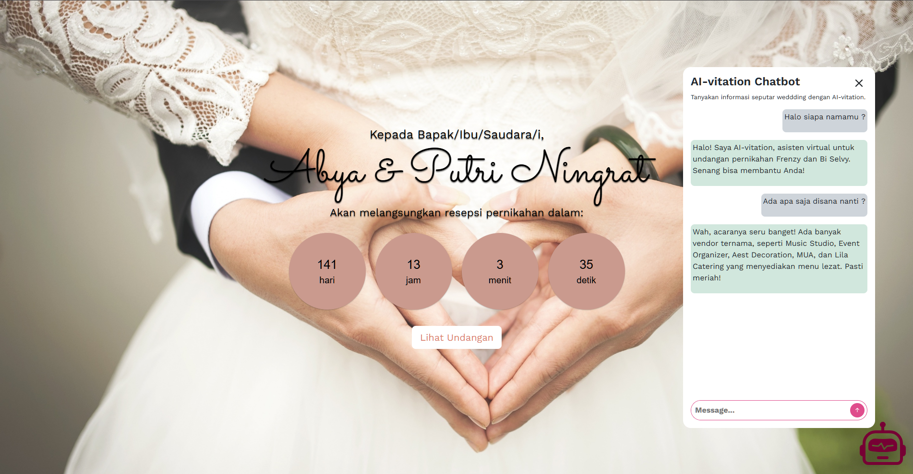

---

# **AI-Vitation: Undangan Digital dengan Chatbot AI**  
🚀 *Inovasi Undangan Digital dengan Integrasi Chatbot AI sebagai Customer Service Online*  

  

## ✨ **Tentang Proyek Ini**  
**AI-Vitation** adalah solusi undangan digital interaktif yang dilengkapi dengan **chatbot AI** untuk menjawab pertanyaan tamu secara otomatis. Proyek ini dikembangkan sebagai contoh produk dalam **Program Kreativitas Mahasiswa-Kewirausahaan (PKM-K) 2025**, dengan fokus pada inovasi dalam integrasi AI untuk meningkatkan pengalaman pengguna dalam menerima dan mengelola undangan digital.  

Chatbot AI yang digunakan dalam proyek ini didukung oleh **Gemini 1.5 Flash 8B**, yang berfungsi sebagai **Customer Service (CS) Online** untuk membantu tamu mendapatkan informasi seputar acara pernikahan secara instan dan otomatis.  

---

## 📌 **Fitur Utama**  
✅ **Undangan Digital Interaktif** – Undangan berbasis web dengan desain elegan dan responsif.  
✅ **Chatbot AI sebagai CS Online** – Chatbot berbasis **Gemini 1.5 Flash 8B** untuk menjawab pertanyaan seputar acara.  
✅ **Dukungan Multiplatform** – Bisa diakses dari **desktop & mobile** tanpa perlu instalasi aplikasi.  
✅ **Pengelolaan Tamu Otomatis** – Sistem dapat mencatat dan mengelola daftar tamu yang telah RSVP.  
✅ **Tampilan Responsif & Ringan** – Dibangun menggunakan **Vanilla HTML, CSS, dan JavaScript** untuk performa maksimal.  

---

## 🛠 **Teknologi yang Digunakan**  
| Teknologi          | Deskripsi |
|--------------------|-----------|
| **Frontend**      | Vanilla **HTML, CSS, JavaScript** (tanpa framework) |
| **Backend**       | **Express.js** (Node.js) untuk membuat request API AI Gemini dari sisi server |
| **Chatbot AI**    | **Gemini 1.5 Flash 8B API** untuk pemrosesan percakapan otomatis |
| **Hosting**       | Host di platform free Vercel, lihat preview [**disini**](https://ai-vitation-undangan-digital.vercel.app/?nama=Frenzy%20Ardian%20Kusumo&p=Bapak), |

---

## 📂 **Struktur Proyek**  
```bash
UNDANGAN-DIGITAL-V1/
│── api/                                    # Folder backend (Express.js)
│   ├── gemini.js                           # controller API untuk send prompt ke Gemini
│── public/                                 # Folder frontend ( html, css, js )
│   ├── index.html                          # Halaman utama undangan digital
|   │── audio/                              # Folder File CSS
│     ├── sound.mp3                         # Sound Music Payung Teduh AKAD 
|   │── countdown/                          # Folder File JS
│     ├── simplyCountdown.min.js            # Script modal chatbot
|     ├── simplyCountdown.theme.default.css # Script untuk mengambil parameter url
|   │── img/                                # Folder File CSS
|       │── gallery/                        # Folder File Gallery JPG
|         ├── 1.jpg        
|         ├── 2.jpg
|       │── thumbnail/                      # Folder File Thumbnail JPG
|         ├── 1.jpg        
|         ├── 2.jpg
|       other.jpg                           # File Gambar Pengantin dan lain lainya.
|       other.jpg            
│     ├── chatbot.css                       # Styling Modal Chatbot 
|     ├── style.css                         # File CSS utama
|   │── scripts/                            # Folder File JS
│     ├── chatbot.js                        # Script modal chatbot
|     ├── landing-page.js                   # Script untuk mengambil parameter url
|   │── styles/                             # Folder File CSS
│     ├── chatbot.css                       # Styling Modal Chatbot 
|     ├── style.css                         # File CSS utama
│── .env                                    # File konfigurasi environment (API keys, dll)
│── server.js                               # Main File untuk server express JS
│── vercel.json                             # Konfigurasi untuk deploy di Vercel
│── README.md                               # Dokumentasi proyek untuk Github
│── package.json                            # Dependencies Node.js
└── 
```

---

## 🚀 **Cara Menjalankan Proyek**  
### 1️⃣ **Clone Repository**  
```sh
git clone https://github.com/abyalax/AI-Vitation-Undangan-Digital.git
cd AI-Vitation-Undangan-Digital
```

### 2️⃣ **Instalasi Dependencies**  
Pastikan kamu sudah menginstal **Node.js** (minimal versi 16). Lalu jalankan:  
```sh
npm install
```

### 3️⃣ **Konfigurasi API**  
Buat file `.env` di root proyek dan tambahkan API Key dari **Gemini 1.5 Flash 8B**:  
```env
GEMINI_API_KEY=your_api_key_here
```

### 4️⃣ **Menjalankan Server**  
Jalankan backend dengan perintah:  
```sh
npm start
```
Atau jika ingin pengawasan otomatis saat coding, gunakan `nodemon`:  
```sh
npm run dev
```
Setelah itu, buka browser dan akses **http://localhost:3000/**  

---

## 🧪 **Testing Chatbot AI**  
Setelah server berjalan, kamu bisa menguji chatbot dengan mengirimkan request API menggunakan **Postman** atau `cURL`:  
```sh
curl -X POST "http://localhost:5000/chat" -H "Content-Type: application/json" -d '{"message": "Halo, kapan acara wedding berlangsung?"}'
```
Chatbot akan merespons sesuai dengan informasi yang tersedia.

---

## 📌 **Roadmap Pengembangan**  
🔹 **v1 (Existing Projects)** – Undangan digital dengan fitur dasar  
🔹 **v2** – Integrasi chatbot AI  
🔹 **v3** – UI/UX enhancement

---

## 🤝 **Kontribusi**  
Kami terbuka untuk kontribusi! Jika ingin berkontribusi:  
1. **Fork** repository ini  
2. **Buat branch** fitur baru: `git checkout -b fitur-baru`  
3. **Commit perubahan**: `git commit -m "Menambahkan fitur X"`  
4. **Push ke branch**: `git push origin fitur-baru`  
5. **Buat Pull Request** di GitHub  

---

## 📜 **Lisensi**  
Proyek ini menggunakan lisensi **MIT**, yang berarti bebas digunakan, dimodifikasi, dan didistribusikan dengan tetap memberikan atribusi kepada pengembang.  

📌 **Creator:** [@abyalax](https://github.com/abyalax)  

---
